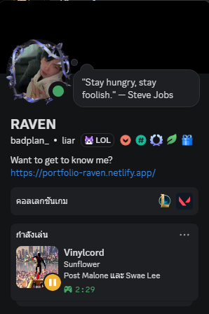
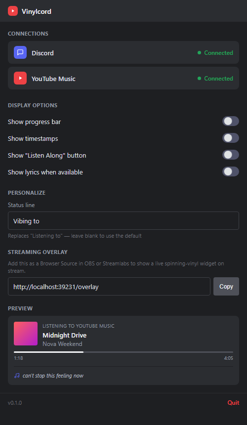
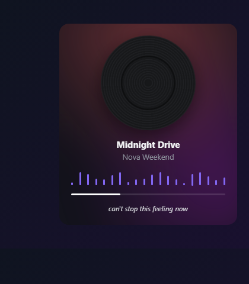

# Vinylcord

Show what's playing on YouTube Music as a live status on Discord, with a spinning-vinyl overlay you can drop straight into OBS.




## What it does

Vinylcord is a small desktop app that wraps YouTube Music. Open it, sign in like you normally would, and it quietly reads what's playing and pushes it out in two places:

- **Discord Rich Presence** — song, artist, album art, a real elapsed/duration bar, a play/pause indicator, and a "Listen Along" button that opens the track.
- **A streaming overlay** — a spinning vinyl record, an animated waveform, and the current lyric line, served as a local page you can drop into OBS or Streamlabs as a Browser Source.




## Download

Grab the latest installer from the [Releases page](https://github.com/raven-clown/vinylcord/releases) and run it. Vinylcord checks for updates on its own after that.

## Why a desktop app instead of a browser extension

Discord Rich Presence only talks to a local app over IPC, and a browser extension can't reach that on its own. Vinylcord just wraps the real music.youtube.com in an Electron window, so there's nothing extra to install and no separate server to run by hand.

## Using it

Open the app and sign in to YouTube Music like you normally would — your session is remembered, so you won't have to do that again. Play something, and your Discord status updates within a few seconds; nothing else to configure.

A small round button floats in the corner of the window (drag it anywhere that's out of the way). Click it to open the settings panel, where you can:

- Turn the elapsed/duration bar and the "Listen Along" button on or off
- Replace the default "Listening to" line with your own text
- Show the current lyric line instead of the artist, when the lyrics panel is open in YouTube Music
- Copy the overlay URL to paste into OBS
- Check at a glance whether Discord and YouTube Music are actually connected

## Using the stream overlay

1. Open the settings panel and copy the overlay URL (`http://localhost:39231/overlay` by default).
2. In OBS: **Sources → Add → Browser Source**, paste the URL, and set the size to roughly 340×480.
3. Leave "Shutdown source when not visible" unchecked so it keeps updating between scenes.

The widget stays invisible whenever nothing is playing, so it's safe to leave sitting on a scene permanently.

## What Discord can and can't actually show

Discord renders Rich Presence itself, so a third-party app can only hand it text, a static image, timestamps, and up to two buttons. The vinyl spin and waveform only exist in Vinylcord's own overlay and settings preview, not inside Discord's profile card. The card does get a real, live elapsed-time bar (Discord draws that natively from timestamps), a small play/pause badge on the album art, and can show the current lyric line as text, updating every couple of seconds.

## Building from source

You'll need [Node.js](https://nodejs.org) 22 or newer.

```bash
git clone https://github.com/raven-clown/vinylcord.git
cd vinylcord
npm install
npm start
```

This runs Vinylcord against the shared default Discord application, the same one the installer uses. To test against your own Discord application instead, create one at the [Discord Developer Portal](https://discord.com/developers/applications), then set its Application ID before starting:

```bash
# Windows (PowerShell)
$env:DISCORD_CLIENT_ID = "your application id"

# macOS / Linux
export DISCORD_CLIENT_ID="your application id"
```

To build a Windows installer yourself:

```bash
npm run dist
```

The installer lands in `dist/`.

## A note on YouTube Music's DOM

YouTube Music has no public "now playing" API, so Vinylcord reads the page's own elements directly. That's inherently a little fragile: if Google changes the player's markup, playback detection can break. If that happens, `src/preload-ytmusic.js` is the only file that should need fixing.

## Contributing

Pull requests are welcome — see [CONTRIBUTING.md](CONTRIBUTING.md).

## License

MIT, see [LICENSE](LICENSE).
